# 🏗️ DPX-OCaml: Architecture & Dependency Report

- **Target Path:** `/Volumes/External/Code/ASGARD-5877`
- **Dune Project:** Yes
- **Files Scanned:** `204`
- **Modules Count:** `134`
- **Dependency Edges:** `466`
- **Cycles / Circular Dependencies:** `0` (Clean DAG)
- **Scan Elapsed Time:** `0.222s`

## 📊 Architecture Health Summary

| Severity | Count | Status |
|---|:---:|---|
| **Errors (❌)** | **0** | **0 errors — No circular dependencies or broken abstractions** |
| **Warnings (⚠️)** | **7** | God modules (>400 LOC) — lifters, emitters, profiler |
| **Info (ℹ️)** | **27** | Zone of pain / concrete ADT types (benign by design) |

## 📚 Dune Libraries & Dependencies

| Library | Modules | Local Dependencies | External Dependencies |
|---|:---:|---|---|
| **arm64_lifter** | 3 | `vm_ir` | — |
| **c_macro_obf** | 9 | — | — |
| **cff** | 2 | `vm_ir` | — |
| **gpu_synth** | 1 | — | — |
| **mba_engine** | 6 | `vm_ir` | — |
| **multi_vm** | 3 | `vm_ir`, `native_vm` | — |
| **native_vm** | 13 | `random_visa_domain`, `vm_ir`, `mba_engine`, `cff` | `yojson` |
| **random_visa_application** | 6 | `random_visa_domain`, `random_visa_ports` | — |
| **random_visa_assembler** | 1 | `random_visa_domain`, `random_visa_ports` | — |
| **random_visa_c11_emitter** | 1 | `random_visa_domain`, `random_visa_ports` | — |
| **random_visa_compiler_adapter** | 1 | `random_visa_domain`, `random_visa_ports` | `unix` |
| **random_visa_cpp_emitter** | 2 | `random_visa_domain`, `random_visa_ports` | — |
| **random_visa_domain** | 14 | — | — |
| **random_visa_ports** | 1 | `random_visa_domain` | — |
| **random_visa_sail_export** | 1 | `random_visa_domain`, `random_visa_ports` | — |
| **random_visa_sail_parser** | 2 | `random_visa_domain`, `random_visa_ports` | — |
| **rd_jit_vm** | 1 | `vm_ir`, `native_vm`, `cff` | — |
| **vanguard_9292** | 4 | `random_visa_domain` | — |
| **vm_ir** | 17 | — | — |
| **x86_lifter** | 2 | `vm_ir` | — |

## 🏛️ Hexagonal Architecture Layers

Dependencies must strictly point inward: `API / Entry Points → Domain Layer ← Adapters / Infrastructure`.

### API / Entry Points (9 modules)

| Module | File | LOC | Interface (.mli) | Dune Library |
|---|---|:---:|:---:|---|
| `Cli_isa` | `bin/cli_isa.ml` | 214 | No | `—` |
| `Cli_project` | `bin/cli_project.ml` | 218 | No | `—` |
| `Cli_protect` | `bin/cli_protect.ml` | 363 | No | `—` |
| `Cli_protect_arm64` | `bin/cli_protect_arm64.ml` | 351 | No | `—` |
| `Cli_vanguard` | `bin/cli_vanguard.ml` | 120 | No | `—` |
| `Gen_crackme_vm` | `bin/gen_crackme_vm.ml` | 71 | No | `—` |
| `Gen_crypto_crackme` | `bin/gen_crypto_crackme.ml` | 154 | No | `—` |
| `Main` | `bin/main.ml` | 19 | No | `—` |
| `Profile_bottlenecks` | `bin/profile_bottlenecks.ml` | 464 | No | `—` |

### Domain Core (14 modules)

| Module | File | LOC | Interface (.mli) | Dune Library |
|---|---|:---:|:---:|---|
| `Dispatch_strategy` | `lib/domain/dispatch_strategy.ml` | 88 | Yes | `random_visa_domain` |
| `Errors` | `lib/domain/errors.ml` | 39 | Yes | `random_visa_domain` |
| `Generation_profile` | `lib/domain/generation_profile.ml` | 49 | Yes | `random_visa_domain` |
| `Hw_cost` | `lib/domain/hw_cost.ml` | 73 | Yes | `random_visa_domain` |
| `Instruction_class` | `lib/domain/instruction_class.ml` | 44 | Yes | `random_visa_domain` |
| `Instruction_family` | `lib/domain/instruction_family.ml` | 54 | Yes | `random_visa_domain` |
| `Isa_grammar` | `lib/domain/isa_grammar.ml` | 219 | Yes | `random_visa_domain` |
| `Mutation_profile` | `lib/domain/mutation_profile.ml` | 47 | Yes | `random_visa_domain` |
| `Sail_ast` | `lib/domain/sail_ast.ml` | 136 | Yes | `random_visa_domain` |
| `Types` | `lib/domain/types.ml` | 239 | Yes | `random_visa_domain` |
| `Vector_config` | `lib/domain/vector_config.ml` | 41 | Yes | `random_visa_domain` |
| `Vector_instruction` | `lib/domain/vector_instruction.ml` | 127 | Yes | `random_visa_domain` |
| `Vector_isa_spec` | `lib/domain/vector_isa_spec.ml` | 109 | Yes | `random_visa_domain` |
| `Vm_runtime_profile` | `lib/domain/vm_runtime_profile.ml` | 19 | Yes | `random_visa_domain` |

## 📐 Robert C. Martin Component Metrics

Mnemonic definitions:
- **Ca (Afferent Coupling):** Number of modules outside this module that depend on it (incoming).
- **Ce (Efferent Coupling):** Number of modules that this module depends upon (outgoing).
- **I (Instability):**  = rac{Ce}{Ca + Ce}$. Range 1$; zsh$ = maximally stable, $ = maximally unstable.
- **A (Abstractness):** Ratio of abstract types / interfaces to total types.
- **D (Distance from Main Sequence):**  = |A + I - 1|$. Distance from ideal balance line.

| Module | Library | Layer | LOC | Ca | Ce | Instability (I) | Abstractness (A) | Distance (D) |
|---|---|---|:---:|:---:|:---:|:---:|:---:|:---:|
| `Arm64_lifter` | `arm64_lifter` | unknown | 732 | 5 | 3 | 0.38 | 0.00 | 0.62 |
| `Arm64_parser` | `arm64_lifter` | unknown | 418 | 2 | 1 | 0.33 | 0.00 | 0.67 |
| `Literal_stitcher` | `arm64_lifter` | unknown | 23 | 1 | 0 | 0.00 | 1.00 | 0.00 |
| `C_arith_rewriter` | `c_macro_obf` | unknown | 76 | 1 | 2 | 0.67 | 0.00 | 0.33 |
| `C_expr_lexer` | `c_macro_obf` | unknown | 156 | 2 | 0 | 0.00 | 0.00 | 1.00 |
| `C_expr_parser` | `c_macro_obf` | unknown | 314 | 1 | 1 | 0.50 | 0.00 | 0.50 |
| `C_macro_config` | `c_macro_obf` | unknown | 41 | 3 | 0 | 0.00 | 0.00 | 1.00 |
| `C_macro_guards` | `c_macro_obf` | unknown | 327 | 1 | 0 | 0.00 | 0.00 | 1.00 |
| `C_macro_header` | `c_macro_obf` | unknown | 50 | 1 | 3 | 0.75 | 0.00 | 0.25 |
| `C_macro_obf` | `c_macro_obf` | unknown | 215 | 6 | 4 | 0.40 | 0.00 | 0.60 |
| `C_macro_templates` | `c_macro_obf` | unknown | 186 | 1 | 0 | 0.00 | 0.00 | 1.00 |
| `C_nanomites` | `c_macro_obf` | unknown | 334 | 1 | 1 | 0.50 | 0.00 | 0.50 |
| `Cff` | `cff` | unknown | 135 | 4 | 3 | 0.43 | 0.00 | 0.57 |
| `Pop_coupler` | `cff` | unknown | 55 | 1 | 2 | 0.67 | 0.00 | 0.33 |
| `Cli_isa` | `—` | api | 214 | 1 | 8 | 0.89 | 0.00 | 0.11 |
| `Cli_project` | `—` | api | 218 | 1 | 4 | 0.80 | 0.00 | 0.20 |
| `Cli_protect` | `—` | api | 363 | 1 | 8 | 0.89 | 0.00 | 0.11 |
| `Cli_protect_arm64` | `—` | api | 351 | 1 | 7 | 0.88 | 0.00 | 0.12 |
| `Cli_vanguard` | `—` | api | 120 | 1 | 6 | 0.86 | 0.00 | 0.14 |
| `Coverage_audit` | `—` | unknown | 79 | 0 | 0 | 0.00 | 0.00 | 1.00 |
| `Gen_crackme_vm` | `—` | api | 71 | 0 | 3 | 1.00 | 0.00 | 0.00 |
| `Gen_crypto_crackme` | `—` | api | 154 | 0 | 7 | 1.00 | 0.00 | 0.00 |
| `Gpu_synth` | `gpu_synth` | unknown | 25 | 1 | 0 | 0.00 | 1.00 | 0.00 |
| `Main` | `—` | api | 19 | 0 | 5 | 1.00 | 0.00 | 0.00 |
| `Mba_Verified` | `—` | unknown | 76 | 0 | 0 | 0.00 | 0.00 | 1.00 |
| `Egraph` | `mba_engine` | unknown | 113 | 3 | 6 | 0.67 | 0.00 | 0.33 |
| `Egraph_extract` | `mba_engine` | unknown | 194 | 1 | 2 | 0.67 | 0.00 | 0.33 |
| `Egraph_rules` | `mba_engine` | unknown | 160 | 1 | 2 | 0.67 | 0.00 | 0.33 |
| `Egraph_types` | `mba_engine` | unknown | 117 | 3 | 1 | 0.25 | 0.00 | 0.75 |
| `Mba` | `mba_engine` | unknown | 234 | 10 | 2 | 0.17 | 0.00 | 0.83 |
| `Ncfg_synth` | `mba_engine` | unknown | 51 | 1 | 1 | 0.50 | 1.00 | 0.50 |
| `Bridge` | `multi_vm` | unknown | 151 | 3 | 0 | 0.00 | 0.00 | 1.00 |
| `Multi_vm_emitter` | `multi_vm` | unknown | 175 | 2 | 6 | 0.75 | 0.00 | 0.25 |
| `Partitioner` | `multi_vm` | unknown | 83 | 2 | 1 | 0.33 | 0.00 | 0.67 |
| `Defuse_scrambler` | `native_vm` | unknown | 51 | 1 | 2 | 0.67 | 0.00 | 0.33 |
| `Egraph_cpp_emitter` | `native_vm` | unknown | 99 | 2 | 2 | 0.50 | 0.00 | 0.50 |
| `Hardened_runtime` | `native_vm` | unknown | 641 | 2 | 0 | 0.00 | 0.00 | 1.00 |
| `Metrics` | `native_vm` | unknown | 86 | 9 | 1 | 0.10 | 1.00 | 0.10 |
| `Protection_config` | `native_vm` | unknown | 6 | 11 | 3 | 0.21 | 0.00 | 0.79 |
| `Protection_json` | `native_vm` | unknown | 268 | 1 | 2 | 0.67 | 0.00 | 0.33 |
| `Protection_presets` | `native_vm` | unknown | 316 | 2 | 1 | 0.33 | 0.00 | 0.67 |
| `Protection_types` | `native_vm` | unknown | 75 | 3 | 0 | 0.00 | 0.00 | 1.00 |
| `Vm_context_emitter` | `native_vm` | unknown | 199 | 1 | 0 | 0.00 | 0.00 | 1.00 |
| `Vm_emitter` | `native_vm` | unknown | 351 | 12 | 11 | 0.48 | 0.00 | 0.52 |
| `Vm_handlers_emitter` | `native_vm` | unknown | 490 | 1 | 1 | 0.50 | 0.00 | 0.50 |
| `Vm_runtime_emitter` | `native_vm` | unknown | 291 | 1 | 6 | 0.86 | 0.00 | 0.14 |
| `Vm_transform` | `native_vm` | unknown | 276 | 2 | 3 | 0.60 | 0.00 | 0.40 |
| `Profile_bottlenecks` | `—` | api | 464 | 0 | 13 | 1.00 | 0.00 | 0.00 |
| `Compile_and_verify` | `random_visa_application` | ports | 5 | 1 | 1 | 0.50 | 1.00 | 0.50 |
| `Export_sail` | `random_visa_application` | ports | 5 | 1 | 2 | 0.67 | 1.00 | 0.67 |
| `Generate_emulator` | `random_visa_application` | ports | 5 | 1 | 2 | 0.67 | 1.00 | 0.67 |
| `Import_sail` | `random_visa_application` | ports | 5 | 1 | 2 | 0.67 | 1.00 | 0.67 |
| `Pipeline` | `random_visa_application` | ports | 79 | 1 | 9 | 0.90 | 0.00 | 0.10 |
| `Synthesize_isa` | `random_visa_application` | ports | 8 | 1 | 5 | 0.83 | 1.00 | 0.83 |
| `Assembler_adapter` | `random_visa_assembler` | adapters | 341 | 3 | 5 | 0.62 | 1.00 | 0.62 |
| `C11_emitter_adapter` | `random_visa_c11_emitter` | adapters | 288 | 1 | 5 | 0.83 | 1.00 | 0.83 |
| `Compiler_adapter` | `random_visa_compiler_adapter` | adapters | 77 | 3 | 2 | 0.40 | 1.00 | 0.40 |
| `Cpp_emitter_adapter` | `random_visa_cpp_emitter` | adapters | 226 | 5 | 6 | 0.55 | 1.00 | 0.55 |
| `Cpp_header_emitters` | `random_visa_cpp_emitter` | adapters | 164 | 1 | 3 | 0.75 | 0.00 | 0.25 |
| `Dispatch_strategy` | `random_visa_domain` | domain | 88 | 2 | 0 | 0.00 | 0.00 | 1.00 |
| `Errors` | `random_visa_domain` | domain | 39 | 34 | 0 | 0.00 | 0.00 | 1.00 |
| `Generation_profile` | `random_visa_domain` | domain | 49 | 6 | 2 | 0.25 | 0.00 | 0.75 |
| `Hw_cost` | `random_visa_domain` | domain | 73 | 3 | 3 | 0.50 | 0.00 | 0.50 |
| `Instruction_class` | `random_visa_domain` | domain | 44 | 8 | 1 | 0.11 | 0.00 | 0.89 |
| `Instruction_family` | `random_visa_domain` | domain | 54 | 3 | 3 | 0.50 | 0.00 | 0.50 |
| `Isa_grammar` | `random_visa_domain` | domain | 219 | 14 | 8 | 0.36 | 1.00 | 0.36 |
| `Mutation_profile` | `random_visa_domain` | domain | 47 | 2 | 0 | 0.00 | 0.00 | 1.00 |
| `Sail_ast` | `random_visa_domain` | domain | 136 | 5 | 1 | 0.17 | 0.00 | 0.83 |
| `Types` | `random_visa_domain` | domain | 239 | 23 | 1 | 0.04 | 0.00 | 0.96 |
| `Vector_config` | `random_visa_domain` | domain | 41 | 10 | 2 | 0.17 | 0.00 | 0.83 |
| `Vector_instruction` | `random_visa_domain` | domain | 127 | 20 | 2 | 0.09 | 0.00 | 0.91 |
| `Vector_isa_spec` | `random_visa_domain` | domain | 109 | 25 | 5 | 0.17 | 0.00 | 0.83 |
| `Vm_runtime_profile` | `random_visa_domain` | domain | 19 | 3 | 2 | 0.40 | 0.00 | 0.60 |
| `Ports` | `random_visa_ports` | ports | 24 | 8 | 2 | 0.20 | 1.00 | 0.20 |
| `Sail_export_adapter` | `random_visa_sail_export` | adapters | 23 | 1 | 3 | 0.75 | 1.00 | 0.75 |
| `Ast` | `random_visa_sail_parser` | adapters | 35 | 1 | 0 | 0.00 | 0.00 | 1.00 |
| `Sail_parser_adapter` | `random_visa_sail_parser` | adapters | 219 | 2 | 11 | 0.85 | 1.00 | 0.85 |
| `Rd_jit_emitter` | `rd_jit_vm` | unknown | 602 | 3 | 7 | 0.70 | 0.00 | 0.30 |
| `Run_tests` | `—` | unknown | 34 | 0 | 31 | 1.00 | 0.00 | 0.00 |
| `Test_anti_analysis` | `—` | unknown | 198 | 1 | 7 | 0.88 | 0.00 | 0.12 |
| `Test_anti_pushan` | `—` | unknown | 264 | 1 | 4 | 0.80 | 0.00 | 0.20 |
| `Test_anti_tamper_smc` | `—` | unknown | 333 | 1 | 4 | 0.80 | 0.00 | 0.20 |
| `Test_arm64_lifter` | `—` | unknown | 152 | 1 | 2 | 0.67 | 0.00 | 0.33 |
| `Test_arxiv_innovations` | `—` | unknown | 143 | 1 | 7 | 0.88 | 0.00 | 0.12 |
| `Test_assembler` | `—` | unknown | 207 | 1 | 8 | 0.89 | 0.00 | 0.11 |
| `Test_assembler_deep` | `—` | unknown | 62 | 1 | 5 | 0.83 | 0.00 | 0.17 |
| `Test_c11_emulator` | `—` | unknown | 85 | 1 | 9 | 0.90 | 0.00 | 0.10 |
| `Test_c_macro_obf` | `—` | unknown | 318 | 1 | 2 | 0.67 | 0.00 | 0.33 |
| `Test_cli` | `—` | unknown | 85 | 1 | 0 | 0.00 | 0.00 | 1.00 |
| `Test_compiler_pipeline` | `—` | unknown | 100 | 1 | 11 | 0.92 | 0.00 | 0.08 |
| `Test_cpp_emulator` | `—` | unknown | 39 | 1 | 4 | 0.80 | 0.00 | 0.20 |
| `Test_domain_invariants` | `—` | unknown | 176 | 1 | 6 | 0.86 | 0.00 | 0.14 |
| `Test_egraph_expansion` | `—` | unknown | 257 | 1 | 6 | 0.86 | 0.00 | 0.14 |
| `Test_families_generation` | `—` | unknown | 219 | 1 | 8 | 0.89 | 0.00 | 0.11 |
| `Test_golden` | `—` | unknown | 30 | 1 | 3 | 0.75 | 0.00 | 0.25 |
| `Test_gpu_synth` | `—` | unknown | 27 | 1 | 1 | 0.50 | 0.00 | 0.50 |
| `Test_helpers` | `—` | unknown | 23 | 1 | 0 | 0.00 | 0.00 | 1.00 |
| `Test_hw_cost` | `—` | unknown | 116 | 1 | 6 | 0.86 | 0.00 | 0.14 |
| `Test_isa_grammar` | `—` | unknown | 129 | 1 | 6 | 0.86 | 0.00 | 0.14 |
| `Test_multi_vlen` | `—` | unknown | 33 | 1 | 5 | 0.83 | 0.00 | 0.17 |
| `Test_multi_vm` | `—` | unknown | 124 | 1 | 4 | 0.80 | 0.00 | 0.20 |
| `Test_native_vm_and_metrics` | `—` | unknown | 542 | 1 | 5 | 0.83 | 0.00 | 0.17 |
| `Test_properties` | `—` | unknown | 95 | 1 | 4 | 0.80 | 0.00 | 0.20 |
| `Test_protection_config` | `—` | unknown | 73 | 1 | 4 | 0.80 | 0.00 | 0.20 |
| `Test_rd_jit_vm` | `—` | unknown | 90 | 1 | 3 | 0.75 | 0.00 | 0.25 |
| `Test_runtime_profile` | `—` | unknown | 43 | 1 | 3 | 0.75 | 0.00 | 0.25 |
| `Test_sail_parser_roundtrip` | `—` | unknown | 147 | 1 | 10 | 0.91 | 0.00 | 0.09 |
| `Test_vanguard_9292` | `—` | unknown | 135 | 1 | 1 | 0.50 | 0.00 | 0.50 |
| `Test_vanguard_emulator_e2e` | `—` | unknown | 98 | 1 | 4 | 0.80 | 0.00 | 0.20 |
| `Test_vm_ir` | `—` | unknown | 187 | 1 | 4 | 0.80 | 0.00 | 0.20 |
| `Test_x86_lifter` | `—` | unknown | 174 | 1 | 4 | 0.80 | 0.00 | 0.20 |
| `Vanguard_9292` | `vanguard_9292` | unknown | 86 | 3 | 5 | 0.62 | 0.00 | 0.38 |
| `Vanguard_asm` | `vanguard_9292` | unknown | 144 | 1 | 3 | 0.75 | 0.00 | 0.25 |
| `Vanguard_decoder` | `vanguard_9292` | unknown | 107 | 1 | 3 | 0.75 | 0.00 | 0.25 |
| `Vanguard_types` | `vanguard_9292` | unknown | 183 | 3 | 0 | 0.00 | 0.00 | 1.00 |
| `Cfg_transform` | `vm_ir` | unknown | 71 | 1 | 4 | 0.80 | 1.00 | 0.80 |
| `Equivalence` | `vm_ir` | unknown | 68 | 2 | 4 | 0.67 | 0.00 | 0.33 |
| `Flags` | `vm_ir` | unknown | 228 | 9 | 1 | 0.10 | 0.00 | 0.90 |
| `Ir` | `vm_ir` | unknown | 200 | 29 | 2 | 0.07 | 0.00 | 0.94 |
| `Ir_egraph` | `vm_ir` | unknown | 184 | 2 | 1 | 0.33 | 0.33 | 0.33 |
| `Ir_pipeline` | `vm_ir` | unknown | 46 | 1 | 8 | 0.89 | 0.00 | 0.11 |
| `Ir_verify` | `vm_ir` | unknown | 56 | 2 | 2 | 0.50 | 0.00 | 0.50 |
| `Opaque_predicates` | `vm_ir` | unknown | 46 | 1 | 3 | 0.75 | 0.00 | 0.25 |
| `Reference_vm` | `vm_ir` | unknown | 25 | 3 | 3 | 0.50 | 0.00 | 0.50 |
| `Register` | `vm_ir` | unknown | 189 | 32 | 0 | 0.00 | 0.00 | 1.00 |
| `Register_allocator` | `vm_ir` | unknown | 83 | 2 | 3 | 0.60 | 0.00 | 0.40 |
| `Rns` | `vm_ir` | unknown | 177 | 5 | 0 | 0.00 | 0.00 | 1.00 |
| `Rolling_key` | `vm_ir` | unknown | 41 | 2 | 0 | 0.00 | 1.00 | 0.00 |
| `Seed` | `vm_ir` | unknown | 65 | 8 | 0 | 0.00 | 1.00 | 0.00 |
| `Semantic_transform` | `vm_ir` | unknown | 135 | 3 | 3 | 0.50 | 1.00 | 0.50 |
| `Superoperator` | `vm_ir` | unknown | 48 | 1 | 3 | 0.75 | 1.00 | 0.75 |
| `Vm_eval` | `vm_ir` | unknown | 312 | 6 | 3 | 0.33 | 0.00 | 0.67 |
| `Lifter` | `x86_lifter` | unknown | 300 | 11 | 4 | 0.27 | 0.00 | 0.73 |
| `X86_parser` | `x86_lifter` | unknown | 292 | 4 | 1 | 0.20 | 0.00 | 0.80 |

## 🔍 Architectural Issues & Findings

| Sev | Kind | Subject | Finding Message |
|:---:|---|---|---|
| ⚠️ | `god_module` | `Arm64_lifter.Arm64_lifter` | god module: Arm64_lifter has 732 lines of code |
| ⚠️ | `god_module` | `Arm64_lifter.Arm64_parser` | god module: Arm64_parser has 418 lines of code |
| ⚠️ | `god_module` | `Native_vm.Hardened_runtime` | god module: Hardened_runtime has 641 lines of code |
| ⚠️ | `god_module` | `Native_vm.Vm_handlers_emitter` | god module: Vm_handlers_emitter has 490 lines of code |
| ⚠️ | `god_module` | `Profile_bottlenecks` | god module: Profile_bottlenecks has 464 lines of code |
| ⚠️ | `god_module` | `Rd_jit_vm.Rd_jit_emitter` | god module: Rd_jit_emitter has 602 lines of code |
| ⚠️ | `god_module` | `Test_native_vm_and_metrics` | god module: Test_native_vm_and_metrics has 542 lines of code |
| ℹ️ | `hub_module` | `Run_tests` | hub/spaghetti module: Run_tests depends on 31 other modules |
| ℹ️ | `leaky_interface` | `C_macro_obf.C_macro_obf` | leaky interface: C_macro_obf.mli exports 2 types, but none are abstract. Implementation details are fully exposed to 6 clients. |
| ℹ️ | `leaky_interface` | `Mba_engine.Egraph` | leaky interface: Egraph.mli exports 2 types, but none are abstract. Implementation details are fully exposed to 3 clients. |
| ℹ️ | `leaky_interface` | `Mba_engine.Egraph_types` | leaky interface: Egraph_types.mli exports 2 types, but none are abstract. Implementation details are fully exposed to 3 clients. |
| ℹ️ | `leaky_interface` | `Multi_vm.Bridge` | leaky interface: Bridge.mli exports 2 types, but none are abstract. Implementation details are fully exposed to 3 clients. |
| ℹ️ | `leaky_interface` | `Native_vm.Protection_config` | leaky interface: Protection_config.mli exports 11 types, but none are abstract. Implementation details are fully exposed to 11 clients. |
| ℹ️ | `leaky_interface` | `Native_vm.Protection_types` | leaky interface: Protection_types.mli exports 11 types, but none are abstract. Implementation details are fully exposed to 3 clients. |
| ℹ️ | `leaky_interface` | `Random_visa_domain.Hw_cost` | leaky interface: Hw_cost.mli exports 2 types, but none are abstract. Implementation details are fully exposed to 3 clients. |
| ℹ️ | `leaky_interface` | `Random_visa_domain.Sail_ast` | leaky interface: Sail_ast.mli exports 5 types, but none are abstract. Implementation details are fully exposed to 5 clients. |
| ℹ️ | `leaky_interface` | `Random_visa_domain.Types` | leaky interface: Types.mli exports 8 types, but none are abstract. Implementation details are fully exposed to 23 clients. |
| ℹ️ | `leaky_interface` | `Vanguard_9292.Vanguard_9292` | leaky interface: Vanguard_9292.mli exports 6 types, but none are abstract. Implementation details are fully exposed to 3 clients. |
| ℹ️ | `leaky_interface` | `Vanguard_9292.Vanguard_types` | leaky interface: Vanguard_types.mli exports 6 types, but none are abstract. Implementation details are fully exposed to 3 clients. |
| ℹ️ | `leaky_interface` | `Vm_ir.Flags` | leaky interface: Flags.mli exports 3 types, but none are abstract. Implementation details are fully exposed to 9 clients. |
| ℹ️ | `leaky_interface` | `Vm_ir.Ir` | leaky interface: Ir.mli exports 12 types, but none are abstract. Implementation details are fully exposed to 29 clients. |
| ℹ️ | `leaky_interface` | `Vm_ir.Register` | leaky interface: Register.mli exports 4 types, but none are abstract. Implementation details are fully exposed to 32 clients. |
| ℹ️ | `leaky_interface` | `X86_lifter.X86_parser` | leaky interface: X86_parser.mli exports 4 types, but none are abstract. Implementation details are fully exposed to 4 clients. |
| ℹ️ | `orphan_module` | `Coverage_audit` | orphan module: nothing depends on Coverage_audit and it is not an entry point |
| ℹ️ | `orphan_module` | `Mba_Verified` | orphan module: nothing depends on Mba_Verified and it is not an entry point |
| ℹ️ | `zone_of_pain` | `Mba_engine.Mba` | zone of pain: Mba is rigidly concrete (A=0.00) yet heavily depended on by 10 modules (I=0.17, D=0.83) (domain AST / data model: benign by design) |
| ℹ️ | `zone_of_pain` | `Random_visa_domain.Sail_ast` | zone of pain: Sail_ast is rigidly concrete (A=0.00) yet heavily depended on by 5 modules (I=0.17, D=0.83) (domain AST / data model: benign by design) |
| ℹ️ | `zone_of_pain` | `Random_visa_domain.Types` | zone of pain: Types is rigidly concrete (A=0.00) yet heavily depended on by 23 modules (I=0.04, D=0.96) (domain AST / data model: benign by design) |
| ℹ️ | `zone_of_pain` | `Random_visa_domain.Vector_instruction` | zone of pain: Vector_instruction is rigidly concrete (A=0.00) yet heavily depended on by 20 modules (I=0.09, D=0.91) (domain AST / data model: benign by design) |
| ℹ️ | `zone_of_pain` | `Random_visa_domain.Vector_isa_spec` | zone of pain: Vector_isa_spec is rigidly concrete (A=0.00) yet heavily depended on by 25 modules (I=0.17, D=0.83) (domain AST / data model: benign by design) |
| ℹ️ | `zone_of_pain` | `Vm_ir.Flags` | zone of pain: Flags is rigidly concrete (A=0.00) yet heavily depended on by 9 modules (I=0.10, D=0.90) (domain AST / data model: benign by design) |
| ℹ️ | `zone_of_pain` | `Vm_ir.Ir` | zone of pain: Ir is rigidly concrete (A=0.00) yet heavily depended on by 29 modules (I=0.07, D=0.94) (domain AST / data model: benign by design) |
| ℹ️ | `zone_of_pain` | `Vm_ir.Register` | zone of pain: Register is rigidly concrete (A=0.00) yet heavily depended on by 32 modules (I=0.00, D=1.00) (domain AST / data model: benign by design) |
| ℹ️ | `zone_of_pain` | `Vm_ir.Rns` | zone of pain: Rns is rigidly concrete (A=0.00) yet heavily depended on by 5 modules (I=0.00, D=1.00) (domain AST / data model: benign by design) |

## 🗺️ High-Level Library Dependency DAG

```mermaid
graph TD
  subgraph Domain ["Domain Layer"]
    random_visa_domain["random_visa_domain"]
    vm_ir["vm_ir"]
  end
  subgraph Ports ["Ports"]
    random_visa_ports["random_visa_ports"]
  end
  subgraph Application ["Application"]
    random_visa_application["random_visa_application"]
  end
  subgraph Engines ["Protection & Obfuscation Engines"]
    cff["cff"]
    mba_engine["mba_engine"]
    c_macro_obf["c_macro_obf"]
  end
  subgraph Lifters ["Frontend Lifters"]
    arm64_lifter["arm64_lifter"]
    x86_lifter["x86_lifter"]
  end
  subgraph VM_Backends ["VM Backends"]
    native_vm["native_vm"]
    multi_vm["multi_vm"]
    rd_jit_vm["rd_jit_vm"]
    vanguard_9292["vanguard_9292"]
  end
  subgraph Adapters ["Emitters & Adapters"]
    random_visa_cpp_emitter["random_visa_cpp_emitter"]
    random_visa_c11_emitter["random_visa_c11_emitter"]
    random_visa_assembler["random_visa_assembler"]
    random_visa_compiler_adapter["random_visa_compiler_adapter"]
    random_visa_sail_export["random_visa_sail_export"]
    random_visa_sail_parser["random_visa_sail_parser"]
  end

  random_visa_ports --> random_visa_domain
  random_visa_application --> random_visa_ports
  random_visa_application --> random_visa_domain
  random_visa_cpp_emitter --> random_visa_ports
  random_visa_cpp_emitter --> random_visa_domain
  random_visa_c11_emitter --> random_visa_ports
  random_visa_c11_emitter --> random_visa_domain
  random_visa_assembler --> random_visa_ports
  random_visa_assembler --> random_visa_domain
  random_visa_compiler_adapter --> random_visa_ports
  random_visa_compiler_adapter --> random_visa_domain
  random_visa_sail_export --> random_visa_ports
  random_visa_sail_export --> random_visa_domain
  random_visa_sail_parser --> random_visa_ports
  random_visa_sail_parser --> random_visa_domain

  arm64_lifter --> vm_ir
  x86_lifter --> vm_ir
  cff --> vm_ir
  mba_engine --> vm_ir
  native_vm --> vm_ir
  native_vm --> random_visa_domain
  native_vm --> mba_engine
  native_vm --> cff
  multi_vm --> vm_ir
  multi_vm --> native_vm
  rd_jit_vm --> vm_ir
  rd_jit_vm --> native_vm
  rd_jit_vm --> cff
  vanguard_9292 --> random_visa_domain
```

